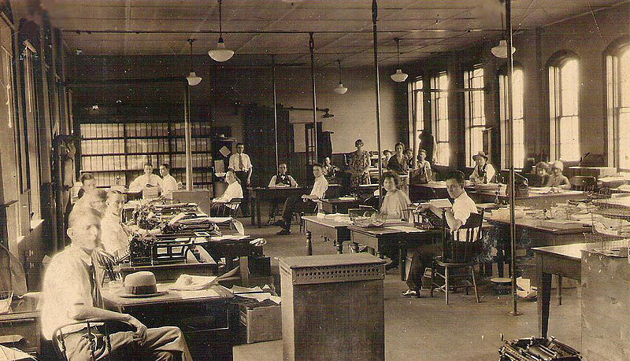
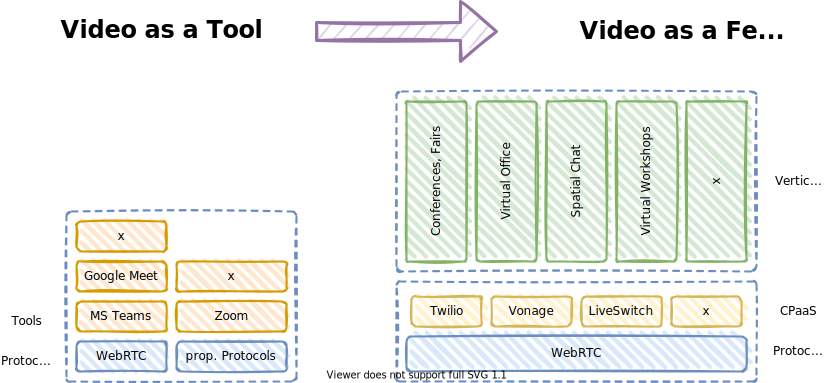
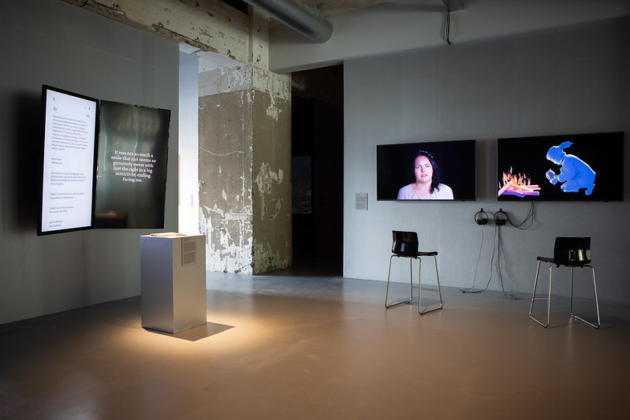

<!-- markdownlint-disable MD025 MD045 MD012 MD024 MD026 -->

# 📷 Video killed the Office Star 🧑‍🎤

## Rückblicke, Einblicke und Vorausblicke in Sachen Zusammenarbeit

Thomas Krause - @thomykay
<!--
footer: Woman having a video conference with friends by Jacob Lund Photography from NounProject.com
-->
---

# ⬅️⬅️ Blick weit zurück

## Wie verstehen Menschen die Welt?

...und andere Menschen?

<!--
footer: Photo by [Jason Leung](https://unsplash.com/@ninjason?utm_source=unsplash&utm_medium=referral&utm_content=creditCopyText) on [Unsplash](https://unsplash.com/s/photos/campfire?utm_source=unsplash&utm_medium=referral&utm_content=creditCopyText)
-->
---

# ⬅️⬅️ Bewegte Bilder (mit Geschichten von fremden Menschen)

<!--
footer: Source: [Geschichte des Kinos](https://de.wikipedia.org/wiki/Geschichte_des_Kinos), Photo by [Mollie Sivaram](https://unsplash.com/@molliesivaram?utm_source=unsplash&utm_medium=referral&utm_content=creditCopyText) on [Unsplash](https://unsplash.com/s/photos/living-room-tv?utm_source=unsplash&utm_medium=referral&utm_content=creditCopyText)
-->
---

# ⬅️⬅️ Wie die Arbeit in die Fabrik kam

* Vor der Industrialisierung war Arbeit Heimarbeit.
* Fabriken wurden um große teure Maschinen (Dampf, später elektrisch) gebaut.
* Die Arbeiter folgten den Maschinen.

<!--
footer: 🔗[Source](https://commons.wikimedia.org/wiki/File:Bundesarchiv_Bild_183-Z1012-315,_Heimarbeit_am_Webstuhl.jpg)
-->
---

# ⬅️⬅️ Wie das Büro in der Fabrik landete

* **erst**: Schreibtische in Ruf- und Blickweite des Geschäftsinhabers.
* **dann**: Das Büro ist auch nur eine andere Art Werkhalle.
* **später**: Kommunikation über weite Entfernungen ist teuer und zeitaufwendig.
* **noch später**: Die Maschinen und das Netzwerk waren nur in der Fabrik.

<!--
footer: 🔗[Source](https://commons.wikimedia.org/wiki/File:C%26O_Railroad_office.jpg)
-->
---

# 💡 Erkenntnis

## Es ist nicht immer so gewesen, dass (bezahlte) Arbeit in der Fabrik stattfand.

## Arbeitsorganisation war schon immer im Wandel begriffen.

## ...und mit ihr Management-Methoden.

> Das was wir da gerade als großes Experiment zusammen durchmachen, haben Menschen schon viele Male in der Geschichte durchgemacht bzw. aktiv gestaltet.

<!--
footer: 💬
-->
---

# ⬅️ Blick zurück

## Geschichten von/mit uns selbst. Als wäre es gestern gewesen...

<!--
footer: Photo by [Kalle Kortelainen](https://unsplash.com/@custodiancontent?utm_source=unsplash&utm_medium=referral&utm_content=creditCopyText) on [Unsplash](https://unsplash.com/s/photos/rearview?utm_source=unsplash&utm_medium=referral&utm_content=creditCopyText)
-->

---

# ⬅️ Blick zurück - Video-Conferencing

* Global IP Solutions (2010) -> (Google) WebRTC (2011) -> IETF 1.0 (2021)
* Cisco -> Zoom (2011)
* Progammable Video, CPaaS (WebRTC based) -> Tokbox -> Twilio, Vonage - (ca. 2018)

<!--
footer: 💬
-->
---

# ⬅️ Blick zurück - Cisco CTS-3000

* ca. 2006, 6 Personen per site, Anfangspreis ca. 300,000$

<!--
footer: Source: [Wikipedia](https://commons.wikimedia.org/wiki/File:Early_CTS-3000_Prototype.jpg)
-->

---

# ⬅️ Blick zurück - Andere Collaboration-Tools

* Writely -> Google Text & Tabellen -> Google Docs (ab 2005)
* Wikidocs -> Atlassian Confluence concurrent editing (2012)
* Google Wave -> Apache Wave (2009)
* Realtimeboard -> Miro (ab 2011)
* Mural (2011)

<!--
footer: 💬
-->

---

# 💡 Erkenntnis

## Eigentlich war es eher ein großes Glück, dass an allem was unsere jetzige WFH-Infrastruktur ausmacht seit mindestens einer Dekade entwickelt wurde.

---

# Ein Dank an alle Nerds!

Wir haben es zu einem guten Teil den technikverliebten **Nerds**, experimentierfreudigen **Entwicklern**, gewissenhaften **Administratoren** und visionären **Gründern** zu verdanken, dass wir 22 Monate *einfach so* weiterarbeiten konnten.

## 🙏Danke!

<!--
footer: Photo by [Fábio Lucas](https://unsplash.com/@fabiooulucas?utm_source=unsplash&utm_medium=referral&utm_content=creditCopyText) on [Unsplash](https://unsplash.com/s/photos/nerd?utm_source=unsplash&utm_medium=referral&utm_content=creditCopyText)
-->
---

# ⬅️ (Mein) Blick zurück - Zusammenarbeit und Meetings

* Räume sprechen Einladungen aus - sei es online oder in Präsenz
* Relevanz gut moderierter Meetings: Liberating Structures, Sociocracy 3.0, Design Thinking, Scrum etc.
* Online-Meetings: Telefon..., oft unmoderiert, "Share Information"
* Asynchrone Zusammenarbeit überwog, synchrone Zusammenarbeit brauchte kein Video

<!--
footer: 💬
-->
---

# ⬅️ (Mein) Blick zurück - Open Spaces, Online Jams etc.

* [24 hour Online Rebel Jam (30 May 2013)](https://allevo.ro/corporate-rebels-united-24-hour-online-rebel-jam-may-30-31/)
* [Stoos Connect (25 Jan 2013)](https://www.youtube.com/user/StoosConnect/videos)
* distributed Learning Communities, distributed Open Spaces in Agilent (from 2014)

---

# ⬅️ Blick zurück - Verteilte Organisationen

* **[Linux](https://www.process.st/how-was-linux-created/)** - verteilte Organisation mit "freundlichem Diktator", 13500 Entwickler seit 1991
* **[Gitlab](https://about.gitlab.com/company/culture/all-remote/guide/)** - led by founder, 1500 members in 65 countries seit 2014
  * "Remote is not a challenge to overcome. It's a clear business advantage."
Victor, Product Manager, GitLab
* **Katholische Kirche** - ~2000 Jahre, ca. 1,3 Mrd Mitglieder, stark verteilt, lokale Standorte, strenge Rollenverteilung und hierarchische Struktur

---

# 💡Erkenntnis

## Pioniere haben mit neuen Formen von Zusammenarbeit, Meetings, Organisationen bereits experimentiert, bevor sie dringend notwendig wurden.

## Oder: Eigentlich sind wir alle Laggards!

---

# ⤵️ Rein in die Pandemie

<!--
footer: Pattern made with PPE face mask by Zamurovic Brothers from NounProject.com
-->
---

# ⤵️ Neues und Altes im Neuen

* Wir machen zum ersten mal unsere Kameras an in Video-Konferenzen
* Was ist eigentlich Zoom-Fatique?
* Teams (launched 2017), war das nicht ein Groupchat-Tool?
* Achje, "face-to-face conversations" != "in the same room"
* Wie "macht" man eigentlich Remote Scrum?
* Spiele-Metaphern für Business-Themen (wonder.me, gather.town)

* > "Es ist jetzt kritische Business-Kompetenz, sich sicher in Multiplayer-Games bewegen zu können."

<!--
footer: 💬
-->
---

# ⤵️ Extremes wird Extremer

* **21%** der Mitarbeiter werden im Home-Office von Software **überwacht** ([Quelle](https://www.fr.de/wirtschaft/frax/wenn-die-chefin-online-ueber-die-schulter-schautwenn-die-chefin-online-ueber-die-schulter-schaut-90882591.html))
  * ➡️ Fake presence: [Play Video in Loop in Zoom To Fake Attend a Meeting](https://gadgetstouse.com/blog/2020/05/11/fake-attend-boring-zoom-meeting/)
  * ➡️ Fake busyness: [Mouse Mover, keeps Corp WFH Laptop from sleeping.](https://www.youtube.com/watch?v=MWMO6uNTKTo)

* [Overemployeed - Work Two Remote Jobs, Reach Financial Freedom](https://overemployed.com/)

---

# 💡 Erkenntnisse

## Viele Praktiken unserer Zusammenarbeit wurden vorher nie hinterfragt. Es geht mehr und besser als wir dachten.

## Toxische Arbeitsumgebungen werden remote noch problematischer.

---

# ⤴️ Raus aus der Pandemie

Was bleibt, was wird?

<!--
footer: Photo by [Max van den Oetelaar](https://unsplash.com/@maxvdo?utm_source=unsplash&utm_medium=referral&utm_content=creditCopyText) on [Unsplash](https://unsplash.com/s/photos/light-tunnel?utm_source=unsplash&utm_medium=referral&utm_content=creditCopyText)
-->
---

# ⤴️ Tools auf Experimentierpfaden

<!--
footer: 💬
-->
---

# ⤴️ Tools auf Experimentier-Pfaden

---

# ⤴️ Video-Conferencing-Tools auf schrägen Pfaden

* [Zoom Focus Mode](https://support.zoom.us/hc/en-us/articles/360061113751-Using-focus-mode-)
* [MS Teams: Mute All](https://techcommunity.microsoft.com/t5/microsoft-teams/microsoft-teams-muting-all-the-participants-without-allowing/m-p/1237601)
* [MS Teams: Lower all hands](https://support.microsoft.com/en-us/office/raise-your-hand-in-a-teams-meeting-bb2dd8e1-e6bd-43a6-85cf-30822667b372)

---

# ⤴️ Consultants on the rise - new fads on the block

## Hybrid

## The new normal

---

# ⤴️ Metaverse?

* Erinnerst Du Dich an [Second Life (23 Jun 2003)](https://en.wikipedia.org/wiki/Second_Life)?
* Kennt irgendjemand noch [VRML - 3D im Browser (1995!)](https://en.wikipedia.org/wiki/VRML)?
* Roblox anyone (2004 - Dynablocks)?

<!--
footer: Photo by [Hammer & Tusk](https://unsplash.com/@hammerandtusk?utm_source=unsplash&utm_medium=referral&utm_content=creditCopyText) on [Unsplash](https://unsplash.com/s/photos/virtual-reality?utm_source=unsplash&utm_medium=referral&utm_content=creditCopyText)
-->

---

# ➡️ Blick nach vorn

<!--
footer: Photo by [Michael Dziedzic](https://unsplash.com/@lazycreekimages?utm_source=unsplash&utm_medium=referral&utm_content=creditCopyText) on [Unsplash](https://unsplash.com/s/photos/crystal-ball?utm_source=unsplash&utm_medium=referral&utm_content=creditCopyText)
-->

---

# ⁉️ These 1 - It's the interactions, stupid!

## Es braucht gelungene Symbiose von Gesprächen, Zusammenarbeit und Meeting-Struktur

<!--
footer: Diverse Team Of Business People Brainstorming In A Modern Office by Flamingo Images from NounProject.com
-->

---

# ⁉️ These 1 - It's the interactions, stupid!

* Das Problem ist nicht (mehr), andere Menschen (noch besser, anders) zu hören und zu sehen.
* Der Schlüssel ist, Autonomie UND Struktur zu ermöglichen.
* Weniger/kürzere Meetings, bessere (Online)-Meetings.
* Wir werden auch in 3 Jahren nicht mit großen Brillen in Business-Meetings sitzen.
* Fast vergessen: Asynchrones Arbeiten.
* Die meisten Organisationen werden in 5 Jahren einen virtuellen Campus haben.

<!--
footer: 💬
-->
---

# ⁉️ These 2 - Druck auf Hybrid-Modelle

## Heutige Modelle werden die nächsten 2 Jahre nicht überleben!

<!--
footer: WEB - Real Feelings Preview- Hanneke Wetzer-9 on [flickr](https://www.flickr.com/photos/mu-eindhoven/51216001560)
-->
---

# ⁉️ These 2 - Druck auf Hybrid-Modelle

* Thema für Legacy-Organisationen, die eigentlich in Präsenz gedacht sind.
* Klartext: Wir können (uns) nicht entscheiden.
* Controller: 200% IT-Kosten, 100% Office-Kosten, 100% Reise-Kosten geht nicht auf Dauer.
* Mehr Organisationen, die von Anfang an verteilt gedacht sind.
* Aus dieser Krise raus, in die Klimakrise rein. ➡️ Mobilität?

---

# ⁉️ These 3 - New Normal ist ein Irrglaube

## Schnelle Veränderung wird jetzt "immer" sein.

<!--
footer: Binder Clips And Paper Clips On Monochrome Paper by Bogdan Dreava from NounProject.com
-->
---

# ⁉️ These 3 - New Normal ist ein Irrglaube

* Hoffnung, Sehnsucht nach "Beruhigung" nachvollziehbar, aber unberechtigt.
* Viele Organisationen haben jetzt nachgeholt, was schon Jahrzehnte unterwegs war.
* Neue und nicht so neue Dynamiken
  * Globalisierung (in eine oder die andere Richtung)
  * Digitalisierung (jaaa!)
  * Klimakrise und damit verbundene Krisen werden uns alles abverlangen.

---

# ⁉️ These 4 - Revival von Nachbarschaft und Heimat

## Mehr Gemeinschaft mit anderen Menschen als denen, mit denen wir Ergebnisse erarbeiten.

<!--
footer: Photo: Von Kreuzschnabel - Eigenes Werk, [CC BY-SA 3.0](https://commons.wikimedia.org/w/index.php?curid=31380706), Source: [Das Comeback des Jahrhunderts](https://www.deutschlandfunkkultur.de/heimarbeit-als-zukunftsmodell-das-comeback-des-jahrhunderts-100.html)
-->
---

# ⁉️ These 4 - Revival von Nachbarschaft und Heimat

* Wir haben Arbeit und Leben 180 Jahre räumlich getrennt. Wir dürfen lernen, dies wieder neu zu verbinden.
* Von der Wohnstadt wieder zurück(?) zur lebendigen Stadt
* Coworking Spaces auf dem Land, Firmen-Büros werden für Coworking geöffnet.

<!--
footer: Source: [Das Comeback des Jahrhunderts](https://www.deutschlandfunkkultur.de/heimarbeit-als-zukunftsmodell-das-comeback-des-jahrhunderts-100.html)
-->

---

# 🤔💭 Was heißt'n das jetzt❔

---

# sli.do/event/37sjrgwl

# www.slido.com #541188

---

# Das Büro ist tot, es lebe...

## die Gestaltung von passenden Räumen für menschliche Begegnungen, so dass einzigartige Ergebnisse entstehen können.

---

twitter:  **@thomykay**
linkedin: **linkedin.com/in/thomaskrause**
